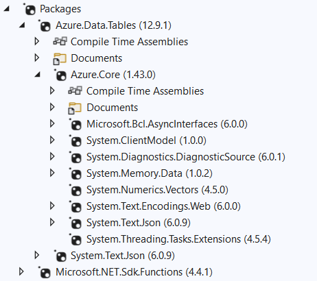
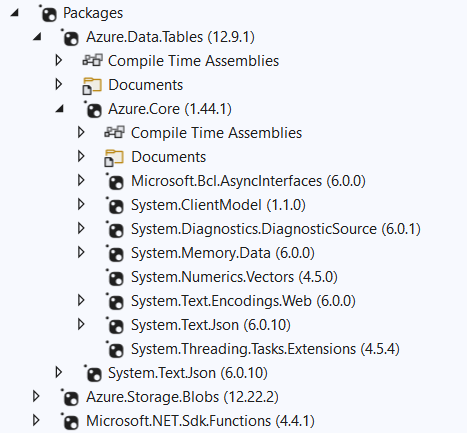

Errors after adding Azure.Storage.Blobs 12.22.2


```
Executed 'helloworld' (Failed, Id=6e74b7a5-98a7-486e-af9c-8b47d9f0c917, Duration=80ms)
System.Private.CoreLib: Exception while executing function: helloworld. Azure.Core: Could not load file or assembly 'System.Memory.Data, Version=6.0.0.0, Culture=neutral, PublicKeyToken=cc7b13ffcd2ddd51'. The system cannot find the file specified.
```


```
ERROR: System.IO.FileNotFoundException: Could not load file or assembly 'System.Memory.Data, Version=6.0.0.0, Culture=neutral, PublicKeyToken=cc7b13ffcd2ddd51'. The system cannot find the file specified.
File name: 'System.Memory.Data, Version=6.0.0.0, Culture=neutral, PublicKeyToken=cc7b13ffcd2ddd51'
   at Azure.Core.RequestContent.Create(Object serializable, ObjectSerializer serializer)
   at Azure.Core.RequestContent.Create(Object serializable)
   at Azure.Data.Tables.TableClient.CreateIfNotExistsAsync(CancellationToken cancellationToken)
   at azfunct1.HelloWorld.Run(HttpRequest req, ILogger log) in xxxxxxx\az-func-cannot-load-assembly\azfunct1\HelloWorld.cs:line 29
```

When everything worked:



After adding  Azure.Storage.Blobs:




??? Related to https://github.com/Azure/azure-functions-core-tools/issues/2872  ???

<br/>
<br/>

---

**Workaround:**  add _FunctionsSkipCleanOutput to project file

```
<PropertyGroup>
	<_FunctionsSkipCleanOutput>true</_FunctionsSkipCleanOutput>
```

---

<br/>
<br/>